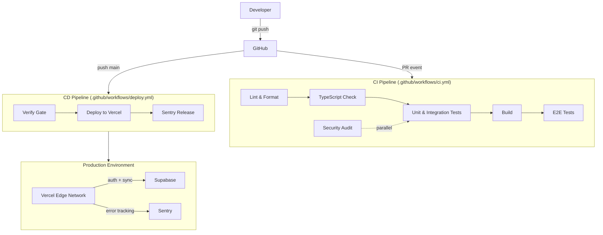

# SpendWise Deployment Architecture

## Overview



## Infrastructure

### Frontend Hosting — Vercel

- **Provider**: Vercel (Global Edge Network)
- **Framework**: Vite + React SPA
- **Region**: Auto (closest to user, 100+ edge locations)
- **Build output**: `dist/` (static files + PWA service worker)
- **Domains**:
  - Production: `spendwise.app` (CNAME to Vercel)
  - Preview: `*.vercel.app` (auto-generated per PR)
- **Headers**:
  - CSP, HSTS, X-Frame-Options, Permissions-Policy (via `vercel.json`)
  - Immutable asset cache (1 year)
  - `index.html` never cached (service worker updates)
- **Rewrites**: SPA fallback — all routes → `/index.html`

### Backend — Supabase

- **Auth**: Built-in Supabase Auth (email/password, magic link, OAuth)
- **Database**: PostgreSQL 15 with Row-Level Security
- **Realtime**: Supabase Realtime (WebSocket sync)
- **Edge Functions**: Gemini AI proxy, Razorpay proxy, invite emails
- **Storage**: User file uploads (receipts, avatars)

### Error Tracking — Sentry

- **DSN**: Set via `VITE_SENTRY_DSN` env var
- **Releases**: Auto-created on deploy via `sentry-release` job
- **Source Maps**: Uploaded from `dist/assets`
- **Performance**: Enabled for API calls and page loads

## Pipeline Design

### CI Pipeline (`ci.yml`)

Triggers on **push** (main/develop) and **pull_request** (main).

```
Lint ──► TypeCheck ──► Unit Tests ──► Build ──► E2E Tests
                                           │
                                     Security Audit (parallel)
```

| Stage      | Tool                                   | Cache            | Timeout |
| ---------- | -------------------------------------- | ---------------- | ------- |
| Lint       | ESLint + Prettier                      | `npm`            | 10m     |
| TypeCheck  | `tsc --noEmit`                         | -                | 5m      |
| Unit Tests | Vitest + Coverage                      | -                | 10m     |
| Build      | Vite                                   | `dist/` artifact | 10m     |
| E2E        | Playwright (Chromium)                  | -                | 15m     |
| Security   | npm audit + CodeQL + Dependency Review | -                | 5m      |

**Gates** (blocking):

- All lint warnings → failure (`--max-warnings 0`)
- TypeScript errors → failure
- Test failures → failure
- Build failure → failure

**Non-blocking** (info only):

- ESLint SARIF upload to GitHub Security tab
- `npm audit` findings (moderate+)
- Dependency Review PR comment

### CD Pipeline (`deploy.yml`)

Triggers on **push to main**. Manual trigger via `workflow_dispatch` for preview deploys.

```
Verify (lint + typecheck + test + build)
         │
    Deploy to Vercel
         │
    Create Sentry Release
```

**Production URL**: Set via Vercel project (custom domain)
**Preview URL**: Commented on PR via `github-script`

### Security Pipeline (`security.yml`)

Triggers **weekly (Monday 09:00 UTC)** and **manual dispatch**.

| Scan         | Tool                     | Output                     |
| ------------ | ------------------------ | -------------------------- |
| npm Audit    | `npm audit` + `audit-ci` | Audit report               |
| CodeQL       | GitHub CodeQL            | Security alerts            |
| OSV Scan     | `osv-scanner`            | Vulnerability database     |
| Secrets      | Gitleaks                 | Hardcoded secret detection |
| Notification | Slack webhook            | Channel alert              |

## Environment Variables

| Variable                 | Required | CI         | Production |
| ------------------------ | -------- | ---------- | ---------- |
| `VITE_SUPABASE_URL`      | Yes      | Via `vars` | Vercel env |
| `VITE_SUPABASE_ANON_KEY` | Yes      | Via `vars` | Vercel env |
| `VITE_SENTRY_DSN`        | No       | -          | Vercel env |
| `VITE_SETU_ENV`          | No       | -          | Vercel env |
| `VITE_DEMO_MODE`         | No       | -          | Vercel env |

## Dependabot

- **Schedule**: Weekly (Monday 09:00 IST)
- **Ecosystems**: npm + GitHub Actions
- **PR grouping**: `react-ecosystem`, `eslint`, `testing`
- **Version strategy**: Increase (major updates trigger separate PRs)
- **Limits**: 10 npm PRs, 5 Actions PRs per run
- **Ignore list**:
  - React >19 (breaking, manual review)
  - TypeScript >5.9
  - Vite >7.2
  - Major framework upgrades (manual migration)

## Security Headers (via Vercel)

```
Content-Security-Policy:
  default-src 'self';
  script-src 'self' 'unsafe-inline' https://checkout.razorpay.com https://*.supabase.co;
  style-src 'self' 'unsafe-inline';
  img-src 'self' data: blob: https:;
  connect-src 'self' https://*.supabase.co wss://*.supabase.co https://api.razorpay.com ...;
  frame-src 'self' https://checkout.razorpay.com;
  worker-src 'self';
Strict-Transport-Security: max-age=31536000; includeSubDomains; preload
X-Content-Type-Options: nosniff
X-Frame-Options: DENY
Referrer-Policy: strict-origin-when-cross-origin
Permissions-Policy: camera=(), microphone=(), geolocation=(), payment=(self)
```

## Monitoring

| Metric           | Tool                | Alert               |
| ---------------- | ------------------- | ------------------- |
| Error rate       | Sentry              | PagerDuty / Slack   |
| Uptime           | Vercel Status       | -                   |
| Build failures   | GitHub Actions      | PR status check     |
| Dependency vulns | Dependabot + CodeQL | GitHub Security tab |
| Deploy success   | GitHub Actions      | Slack notification  |

## Disaster Recovery

1. **Vercel rollback**: Vercel dashboard → Deployments → ... → Promote to Production
2. **Database restore**: Supabase dashboard → Database → Backups → Restore point-in-time
3. **Env rollback**: Vercel → Project Settings → Environment Variables → Show previous values
